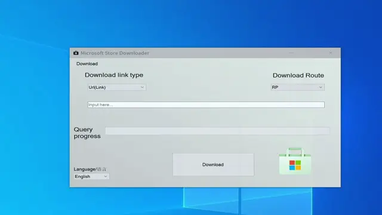

**[中文文档](doc/cn.md)**

## Microsoft Store Downloader
<iframe src="https://ghbtns.com/github-btn.html?user=ThebestkillerTBK&repo=Windows-Store-Downloader&type=star&count=true" frameborder="0" scrolling="0" width="150" height="20" title="GitHub"></iframe>

### Introduction
A tool helps you to download Microsoft Store applications without any limitations.

You can download paid, restricted and free Apps.

You should download packages of your system and install them all.

Some codes are from the Internet.

Example:

### Features
* Download Microsoft Store Apps
* Download without any limitations
* Download paid and restricted Apps

### Links
* Github repo: https://github.com/ThebestkillerTBK/Windows-Store-Downloader

### Video
* China:https://www.bilibili.com/video/(未发布)
* Youtube:https://www.youtube.com/watch?v=(Not_Uploaded)
